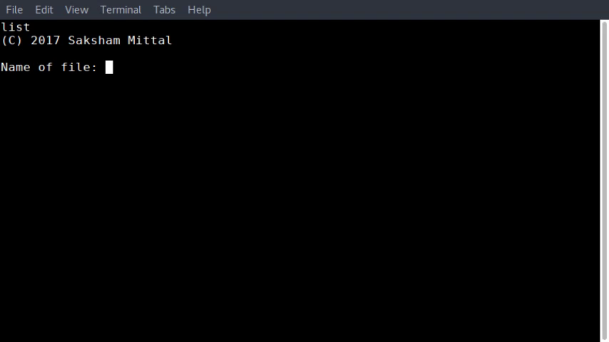
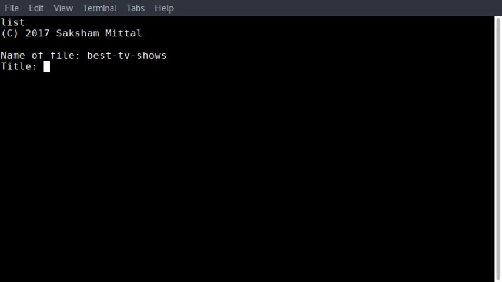
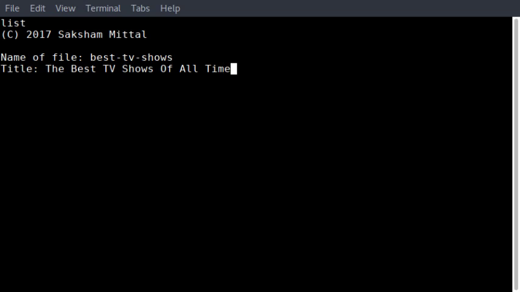
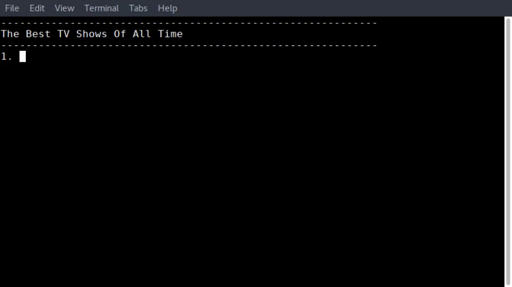
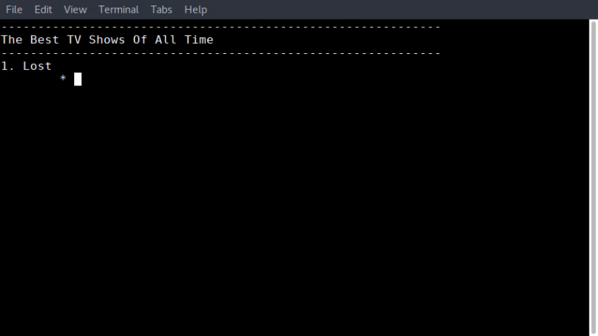
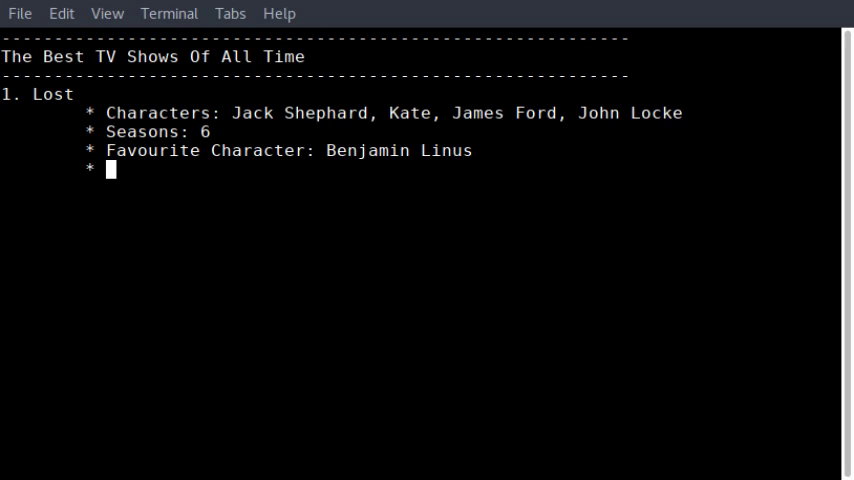
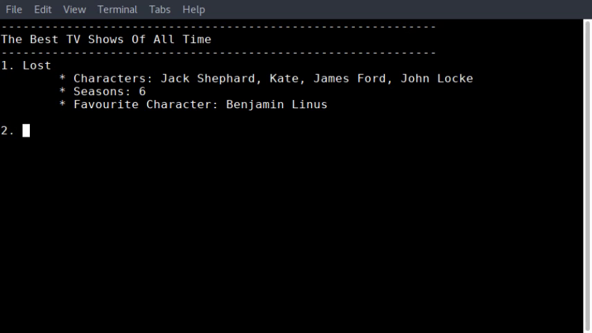
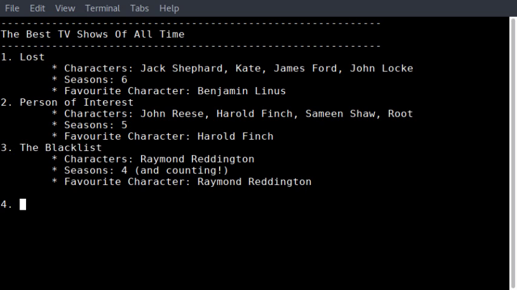
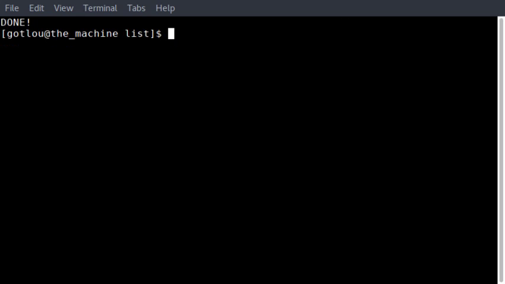

# list
A command-line program that makes a nice little list in plaintext. More features to come!

## Features
* Small command-line interface
* Uses only the Python Standard Library
* As portable as possible
* Small codebase

## Instructions
Soon to come, but right now, it is to be executed as a script.

### For POSIX-based operating systems-

Open up the Terminal and then type the following commands-

     cd path/to/list/
     ./main.py

### For Windows-

Open up the Command Prompt and then type the following commands-

     cd path\to\list\
     python3 main.py
 
 Note that you must have python3 set in your PATH variable in order for this to work.
 
 ## So now that all the boring stuff's out of the way....
 ### How does it all work?
 * list should open up with this screen-
 
 * Type the name of the file that will store the list and press enter
  
 * Type the title of the list and press enter
 
 * list will display this little dialog-
 
 From here on out, list will display your list as it looks like. However, this is NOT a WYSIWYG mode! list is not designed for this type of editing. Editing features are still being added (see edit.py)
 * Let's start making our list. So, I've added Lost as the number 1 item on my list.
 
 * Press enter and you'll get these little asterisks. They're there for you to add some more details about your items. Maybe you need to make a list of favourite TV shows (like here!) or you're reviewing a TV show/movie etc. and you need to store as many details as possible. That's when this feature is helpful.
 * Enter your additional tidbits and press enter.
 * When you're done, just press enter at the asterisk prompts
 
 
 * list returns you to the main ordered list
 * When you're done, press enter at the numbered prompt.
 
 
 
 That's it!
